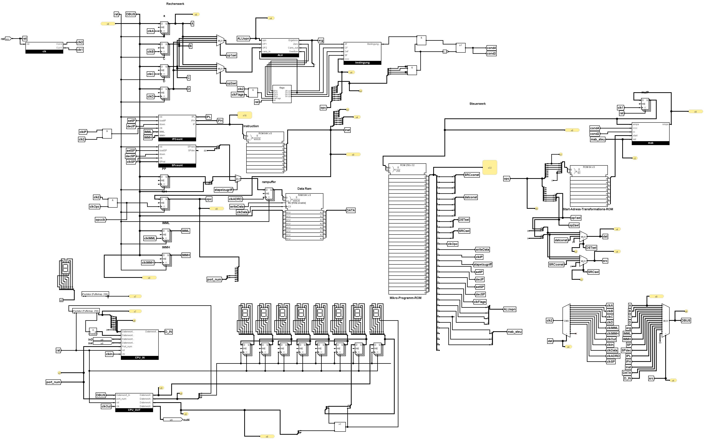

# 8-Bit Logisim CPU

This project implements a 8-bit CPU using Logisim Evolution. The CPU features a microcoded, Harvard architecture (separate instruction and data memory), and a basic instruction set.

## CPU Design




This CPU is designed with a separation between the Rechenwerk (arithmetic/logic unit and registers) and Steuerwerk (control unit). The clock thus has clk1 for the control unit and clk2 for the arithmetic/logic unit.

**Rechenwerk:**

*   **Data Bus (DBUS):** 8-bit wide, carries data between all registers.
*   **Registers (A, B, C, D):** Four 8-bit general-purpose registers that go into the ALU.
*   **Arithmetic Logic Unit (ALU):** Performs arithmetic (addition, subtraction, ) and logical (NAND, shift) operations. Controlled by `ALUopn` signals from the microinstruction ROM.
*   **Flags:** Stores flags like zero, carry, overflow, and sign. Used for conditional jumps.


**Steuerwerk:**

*   **Microinstruction ROM:** Stores microinstructions (256 x 32 bits). Each macro-instruction is translated into a sequence of microinstructions.
*   **Start-Address-Transformations-ROM (offset.rom):** Stores the starting address in the microinstruction ROM for each macro-instruction.
*   **Instruction Register:** Holds the current macro-instruction being executed.
*   **Program Counter (IP):** Points to the next macro-instruction to be fetched. Controlled by signals like `clkIP`, `setIP`, `decIP`.
*   **Condition Logic:**  Allows conditional execution of microinstructions based on the flags from the ALU.

The first instruction fetch, fetches the instruction from the instruction memory and stores it in the Opcode register. This is then split between going to the Start-Address-Transformations-ROM. The Start-Address-Transformations-ROM then loads the first microinstruction and it gets executed. Depending on the value of the microinstruction, the parameters of the instruction are sent to various parts of the CPU. An instructions consists of a 4 bit opcode and 4 bit parameters. These parameters depend on the instruction. They are most often used as either Register/Register, Condition/Register or 4 bit Condition and then an immediate.

Source and Destination selection happens trough the Multiplexer/Demultiplexer. The option can either be selected trough the first or second parameter of the instruction, the microinstruction or 0xFF, which goes nowhere (used for instructions that don't need a source or destination).

If an immediate value is needed it can be loaded into the immediate registers IMML/IMMH. Immediates are stored directly after the opcode in the instruction memory. For example jump first loads IMML and IMMH and uses these to jump to that address. Another example is the const instruction which loads it into IMML and then stores it in a register.

Not every instruction goes back to fetch, but instead directly fetches the next instruction if possible. This is done by setting the `clkOPC=1, clkIP=1, mab_steuerung=mabSteuerung.START.value` signals, which clock the instruction and Opcode register to be loaded into the Start-Address-Transformations-ROM, which then loads the next instruction into the instruction register.

**Other Components:**

*   **Instruction Memory:** 64Kx8 instructions (ROM 256x32 for microcode and ROM 64x8 for offset lookup).
*   **Data Memory:** 64Kx8 RAM.
*   **Input/Output (I/O):** Interacts with external devices (e.g., keyboard, 7-segment display) using IN and OUT instructions.

## Instruction Set

The CPU supports the following macro-instructions:

```asm
mov {r1: register} {r2: register} ; Moves an Register to another Register
add {r1: register} {r2: register} ; Adds two Registers, the result is stored in r1
sub {r1: register} {r2: register}  ; Subtracts r2 from r1, the result is stored in r1
nand {r1: register} {r2: register} ; Bitwise NAND of r1 and r2, the result is stored in r1
shift {r1: register} {r2: register} ; Shifts r1 left by r2 bits
cmp {r1: register} {r2: register} ; Compares r1 and r2, sets flags
store {r1: register} {r2: register} ; store r2 value at RAM address r1
load {r1: register} {r2: register} ; load value into r2 from RAM address r1
const {cc: cc} {r1: register} {imm: u8}
jmp {cccc: cccc} {immh: u8} {imml: u8}
jmp {cccc: cccc} {imm: u16} ; for label jumps
out {port: port} {r1: register} ; output r1 to port 1-4
in {port: port} {r1: register} ; input from port 1-4 to r1
```

## Microcode and Assembler

*   **mpa.py:** Generates the microcode for the CPU and the offset table for instructions.
*   **asm.py:** Uses `customasm` ([https://github.com/hlorenzi/customasm](https://github.com/hlorenzi/customasm)) to assemble the code and then splits the output into instruction ROM and RAM data.

**Output Files (in the `output` folder):**

*   **instructions.rom:** Contains the assembled instructions.
*   **ram.rom:** Contains the RAM data.
*   **offset.rom:** Contains the offsets for instructions in the microcode ROM.
*   **micro_program.rom:** Contains the microcode.


## How to Load a Program

The `main.asm` file contains an example program that takes keyboard input (ASCII characters a-z, 1-9, []{}=!?@-, and .) and displays them on a 7-segment display. The dot toggles the decimal point.

**Prerequisites:**

*   **Logisim Evolution:** Download and install Logisim Evolution from [their GitHub page](https://github.com/logisim-evolution/logisim-evolution/releases).
*   **customasm:** Install `customasm` (on Linux: `cargo install customasm`; on Windows: download the .exe from [latest release](https://github.com/hlorenzi/customasm/releases/latest))
*  **Python 3:** Python 3 is required to run the microcode and assembler scripts.

**Steps:**

1.  Ensure `customasm.exe` (Windows) is in the project folder or `customasm` is installed (Linux: `cargo install customasm`).
2.  Run `python mpa.py` to generate the microcode and offset files (The microcode only needs to be generated once unless the instruction set changes).
3.  Run `python asm.py` to assemble the `main.asm` program and generate the `instructions.rom` and `ram.rom` files.
4.  In Logisim Evolution, load the generated files into the respective components:
    *   `micro_program.rom` into the `Mikro-Programm-ROM`.
    *   `offset.rom` into the `Start-Address-Transformations-ROM`.
    *   `instructions.rom` into the `Instruction ROM`.
    *   `ram.rom` into the `Data Ram`.
5.  For the typewriter example, run the simulation and write something into the keyboard.